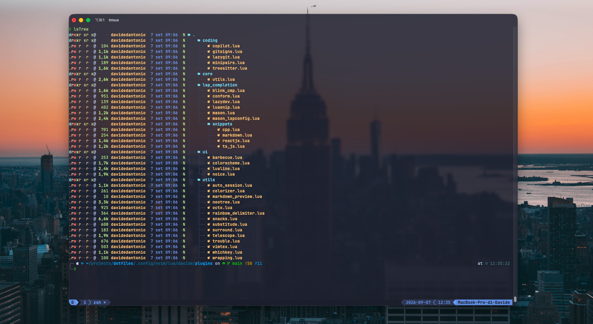
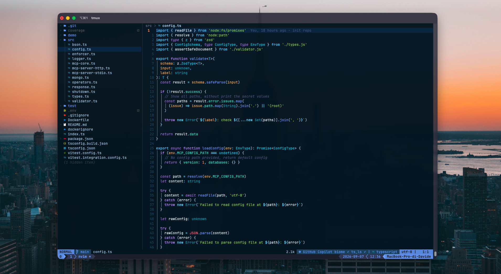

# Dotfiles 🚀

Personal **Neovim** and **tmux** configuration.




> **NOTE:** these dotfiles are meant primarily as inspiration. Don't use them blindly — read what they do before copying them.

---

## Table of Contents

- [Repository structure](#repository-structure)
- [Requirements](#requirements)
- [Installation](#installation)
- [Neovim](#neovim)
  - [Config layout](#config-layout)
  - [Plugins](#neovim-plugins)
  - [Language servers, formatters and linters](#language-servers-formatters-and-linters)
  - [Formatting](#formatting)
  - [Custom snippets](#custom-snippets)
- [tmux](#tmux)
  - [Plugins](#tmux-plugins)
  - [Key bindings](#key-bindings)
- [Neovim ↔ tmux integration](#neovim--tmux-integration)

---

## Repository structure

```
.
├── .config
│   ├── nvim
│   │   ├── init.lua                 # entry point: disables netrw, loads davide.config
│   │   ├── lazy-lock.json           # plugin lockfile (pinned commits)
│   │   └── lua/davide
│   │       ├── config/              # options, keymaps, autocommands, lazy.nvim bootstrap
│   │       └── plugins/
│   │           ├── ui/              # colorscheme, statusline, breadcrumbs, notifications
│   │           ├── coding/          # treesitter, git, pairs, copilot
│   │           ├── utils/           # pickers, file tree, sessions, telescope, etc.
│   │           ├── lsp_completion/  # mason, lspconfig, blink.cmp, conform, snippets
│   │           └── core/            # shared Lua helper functions
│   └── tmux
│       ├── tmux.conf                # main config + theme + TPM plugins
│       ├── tmux.reset.conf          # full key remapping
│       └── scripts/cal.sh           # calendar widget (icalBuddy) for the status bar
└── images/
```

---

## Requirements

| Requirement                                          | Notes                                                                       |
| ---------------------------------------------------- | --------------------------------------------------------------------------- |
| [Neovim](https://neovim.io/) ≥ 0.11                  | needed for the `vim.lsp.config` / `vim.lsp.enable` APIs used in the config  |
| True-color terminal                                  | [WezTerm](https://wezfurlong.org/wezterm/) or [iTerm2](https://iterm2.com/) |
| [Nerd Font](https://www.nerdfonts.com/)              | Meslo Nerd Font is used here                                                |
| [ripgrep](https://github.com/BurntSushi/ripgrep)     | search backend for Telescope and the Snacks picker                          |
| [fd](https://github.com/sharkdp/fd)                  | file search                                                                 |
| [Node.js](https://nodejs.org/) ≥ 22                  | required by the JS/TS language servers                                      |
| [lazygit](https://github.com/jesseduffield/lazygit)  | Git integration inside Neovim                                               |
| [gh](https://cli.github.com/)                        | required by `octo.nvim`                                                     |
| [tmux](https://github.com/tmux/tmux) ≥ 3.3           | for `display-popup` and the options used here                               |
| XCode Command Line Tools                             | to build `telescope-fzf-native` (`make`)                                    |
| `latexmk` + [Skim](https://skim-app.sourceforge.io/) | optional, VimTeX only                                                       |
| `icalBuddy`                                          | optional, `cal.sh` only                                                     |

### Command-line tools used in this workflow

[fzf](https://github.com/junegunn/fzf) · [fd](https://github.com/sharkdp/fd) · [fzf-git](https://github.com/junegunn/fzf-git.sh) · [bat](https://github.com/sharkdp/bat) · [delta](https://github.com/dandavison/delta) · [eza](https://github.com/eza-community/eza) · [tldr](https://github.com/tldr-pages/tldr) · [zoxide](https://github.com/ajeetdsouza/zoxide) (used by `tmux-sessionx`)

### Installing the requirements on macOS

```bash
brew install neovim ripgrep fd fzf bat git-delta eza lazygit gh tmux zoxide
brew install --cask wezterm font-meslo-lg-nerd-font
xcode-select --install
```

---

## Installation

```bash
git clone git@github.com:davidedantonio/dotfiles.git
cd dotfiles

# Neovim
cp -r .config/nvim ~/.config/nvim

# tmux
cp -r .config/tmux ~/.config/tmux

# TPM (tmux plugin manager)
git clone https://github.com/tmux-plugins/tpm ~/.tmux/plugins/tpm
```

On the first `nvim` launch, **lazy.nvim** bootstraps itself and pulls the plugins; **Mason** then installs language servers, formatters and linters in the background (after a 3-second delay). If you open a file and see an error about a server failing to start, that's expected — Mason hasn't finished yet. Press enter and wait.

For tmux, start a session and hit <kbd>Ctrl</kbd>+<kbd>A</kbd> then <kbd>I</kbd> (uppercase) to have TPM install the plugins.

---

## Neovim

### Config layout

`init.lua` disables netrw and loads `lua/davide/config/init.lua`, which in turn requires:

| File                          | Contents                                                   |
| ----------------------------- | ---------------------------------------------------------- |
| `config/keymaps.lua`          | all global key mappings (leader = <kbd>Space</kbd>)        |
| `config/lazy.lua`             | lazy.nvim bootstrap and plugin directory imports           |
| `config/options.lua`          | Vim options                                                |
| `config/highlights.lua`       | highlight group overrides                                  |
| `config/autocommands.lua`     | autocommands                                               |
| `config/custom_functions.lua` | custom helpers (e.g. `OpenFile()`, `ToggleConcealLevel()`) |
| `config/lsp_diagnostic.lua`   | diagnostics look and behaviour                             |

The directories imported by lazy.nvim are `plugins/ui`, `plugins/coding`, `plugins/utils` and `plugins/lsp_completion`. `plugins/core` is **not** a plugin module — it only holds shared Lua helpers.

---

### Neovim plugins

#### Plugin manager

| Plugin                                                | Description                                                                     |
| ----------------------------------------------------- | ------------------------------------------------------------------------------- |
| [folke/lazy.nvim](https://github.com/folke/lazy.nvim) | plugin manager, with a lockfile in `lazy-lock.json` and automatic update checks |

#### Shared dependencies

| Plugin                                                                        | Description                                |
| ----------------------------------------------------------------------------- | ------------------------------------------ |
| [nvim-lua/plenary.nvim](https://github.com/nvim-lua/plenary.nvim)             | Lua utility library used by many plugins   |
| [nvim-tree/nvim-web-devicons](https://github.com/nvim-tree/nvim-web-devicons) | file and filetype icons                    |
| [MunifTanjim/nui.nvim](https://github.com/MunifTanjim/nui.nvim)               | UI components (used by neo-tree and noice) |

#### UI — `plugins/ui/`

| Plugin                                                                    | Description                                                                                |
| ------------------------------------------------------------------------- | ------------------------------------------------------------------------------------------ |
| [folke/tokyonight.nvim](https://github.com/folke/tokyonight.nvim)         | colorscheme (`storm` style) with a custom **coolnight** palette on a `#011323` background  |
| [nvim-lualine/lualine.nvim](https://github.com/nvim-lualine/lualine.nvim) | global statusline (`laststatus=3`) with branch, diff, diagnostics, filesize and LSP status |
| [utilyre/barbecue.nvim](https://github.com/utilyre/barbecue.nvim)         | winbar breadcrumbs with code context                                                       |
| [SmiteshP/nvim-navic](https://github.com/SmiteshP/nvim-navic)             | current symbol context via LSP (barbecue dependency)                                       |
| [folke/noice.nvim](https://github.com/folke/noice.nvim)                   | replaces cmdline, messages and popupmenu — command palette on, scrollbars off              |

#### Coding — `plugins/coding/`

| Plugin                                                                                             | Description                                                                                                                                                                      |
| -------------------------------------------------------------------------------------------------- | -------------------------------------------------------------------------------------------------------------------------------------------------------------------------------- |
| [nvim-treesitter/nvim-treesitter](https://github.com/nvim-treesitter/nvim-treesitter)              | parsing and highlighting (`main` branch); parsers installed for JS/TS/TSX, Lua, Python, C/C++, Java, HTML, CSS, JSON, YAML, Markdown, Bash, Docker, GraphQL, Prisma, Svelte, Vim |
| [windwp/nvim-ts-autotag](https://github.com/windwp/nvim-ts-autotag)                                | auto-close and auto-rename HTML/JSX/Vue/PHP tags                                                                                                                                 |
| [echasnovski/mini.pairs](https://github.com/echasnovski/mini.nvim/blob/main/readmes/mini-pairs.md) | auto-close brackets and quotes                                                                                                                                                   |
| [lewis6991/gitsigns.nvim](https://github.com/lewis6991/gitsigns.nvim)                              | Git signs in the gutter, line blame and hunk actions (`<leader>g…`)                                                                                                              |
| [kdheepak/lazygit.nvim](https://github.com/kdheepak/lazygit.nvim)                                  | lazygit in a floating window, opened at the repo root (`<leader>lg`)                                                                                                             |
| [github/copilot.vim](https://github.com/github/copilot.vim)                                        | GitHub Copilot, enabled at startup                                                                                                                                               |

#### Utilities — `plugins/utils/`

| Plugin                                                                                                  | Description                                                                                       |
| ------------------------------------------------------------------------------------------------------- | ------------------------------------------------------------------------------------------------- |
| [folke/snacks.nvim](https://github.com/folke/snacks.nvim)                                               | the main suite: dashboard, **picker**, notifier, indent guides, zen mode, dim, bufdelete, bigfile |
| [nvim-neo-tree/neo-tree.nvim](https://github.com/nvim-neo-tree/neo-tree.nvim)                           | side file explorer (`<leader>ee`, `<leader>ef`)                                                   |
| [saifulapm/neotree-file-nesting-config](https://github.com/saifulapm/neotree-file-nesting-config)       | file nesting rules for neo-tree                                                                   |
| [nvim-telescope/telescope.nvim](https://github.com/nvim-telescope/telescope.nvim)                       | fuzzy finder (kept alongside the Snacks picker)                                                   |
| [nvim-telescope/telescope-fzf-native.nvim](https://github.com/nvim-telescope/telescope-fzf-native.nvim) | native C sorter for Telescope (requires `make`)                                                   |
| [folke/trouble.nvim](https://github.com/folke/trouble.nvim)                                             | readable list of diagnostics, quickfix, loclist and todos (`<leader>x…`)                          |
| [folke/todo-comments.nvim](https://github.com/folke/todo-comments.nvim)                                 | highlights and searches TODO/FIXME/HACK/BUG                                                       |
| [folke/which-key.nvim](https://github.com/folke/which-key.nvim)                                         | key hints, with groups defined for every leader prefix                                            |
| [rmagatti/auto-session](https://github.com/rmagatti/auto-session)                                       | session save and restore (`<leader>s…`); autosave off by default                                  |
| [pwntester/octo.nvim](https://github.com/pwntester/octo.nvim)                                           | GitHub issues, PRs, discussions and notifications from inside Neovim (`<leader>o…`)               |
| [kylechui/nvim-surround](https://github.com/kylechui/nvim-surround)                                     | manipulate surroundings with `ys`, `ds`, `cs`                                                     |
| [gbprod/substitute.nvim](https://github.com/gbprod/substitute.nvim)                                     | replace with register contents via `s` / `ss` / `S`                                               |
| [HiPhish/rainbow-delimiters.nvim](https://github.com/HiPhish/rainbow-delimiters.nvim)                   | brackets colored by nesting level                                                                 |
| [NvChad/nvim-colorizer.lua](https://github.com/NvChad/nvim-colorizer.lua)                               | inline color previews, with Tailwind class support                                                |
| [andrewferrier/wrapping.nvim](https://github.com/andrewferrier/wrapping.nvim)                           | automatic soft/hard wrap switching based on filetype                                              |
| [lervag/vimtex](https://github.com/lervag/vimtex)                                                       | LaTeX support (`latexmk` compiler, Skim viewer)                                                   |

> `utils/markdown_preview.lua` is currently an empty file (`return {}`): no Markdown preview plugin is active.

#### LSP, completion and formatting — `plugins/lsp_completion/`

| Plugin                                                                                                    | Description                                                                          |
| --------------------------------------------------------------------------------------------------------- | ------------------------------------------------------------------------------------ |
| [williamboman/mason.nvim](https://github.com/williamboman/mason.nvim)                                     | installs language servers, formatters, linters and debug adapters                    |
| [mason-org/mason-lspconfig.nvim](https://github.com/mason-org/mason-lspconfig.nvim)                       | bridge between Mason and nvim-lspconfig, with automatic server enabling              |
| [WhoIsSethDaniel/mason-tool-installer.nvim](https://github.com/WhoIsSethDaniel/mason-tool-installer.nvim) | installs and updates tools automatically on startup                                  |
| [neovim/nvim-lspconfig](https://github.com/neovim/nvim-lspconfig)                                         | base LSP server configurations                                                       |
| [saghen/blink.cmp](https://github.com/Saghen/blink.cmp)                                                   | completion engine (replaces nvim-cmp); sources: lazydev, LSP, path, snippets, buffer |
| [L3MON4D3/LuaSnip](https://github.com/L3MON4D3/LuaSnip)                                                   | snippet engine, with autosnippets enabled                                            |
| [rafamadriz/friendly-snippets](https://github.com/rafamadriz/friendly-snippets)                           | snippet collection for many languages                                                |
| [folke/lazydev.nvim](https://github.com/folke/lazydev.nvim)                                               | completion and types for the Neovim Lua API                                          |
| [stevearc/conform.nvim](https://github.com/stevearc/conform.nvim)                                         | formatting, including on save (`<leader>Fm` to format manually)                      |

---

### Language servers, formatters and linters

Installed automatically by `mason-tool-installer` (auto-update on, with a 5-hour debounce):

**Language servers:** `bash-language-server`, `lua-language-server`, `vim-language-server`, `html-lsp`, `emmet-ls`, `css-lsp`, `json-lsp`, `typescript-language-server`, `eslint-lsp`, `tailwindcss-language-server`, `pyright`, `clangd`

**Formatters and linters:** `stylua`, `prettier`, `biome`, `black`, `autopep8`, `clang-format`, `editorconfig-checker`

**Debug adapters:** `js-debug-adapter`, `codelldb`

The servers configured explicitly in `mason_lspconfig.lua` are `lua_ls`, `ts_ls`, `eslint`, `biome`, `emmet_ls`, `cssls`, `html`, `tailwindcss`, `pyright` and `clangd`.

### Formatting

Rules live in `conform.nvim`, with **format on save** enabled (2s timeout, LSP fallback):

| Language                                           | Formatter                          |
| -------------------------------------------------- | ---------------------------------- |
| JavaScript / TypeScript (+ React)                  | `biome-organize-imports` → `biome` |
| JSON / JSONC / CSS                                 | `biome`                            |
| HTML / YAML / Markdown / GraphQL / Svelte / Liquid | `prettier`                         |
| Lua                                                | `stylua`                           |
| Python                                             | `isort` → `black`                  |

### Custom snippets

In `plugins/lsp_completion/snippets/`:

| File           | Snippets                                                                                  |
| -------------- | ----------------------------------------------------------------------------------------- |
| `ts_js.lua`    | `req` (require), `tych` (try/catch), `rex` (express), `exrout` (express Router), `dotenv` |
| `reactjs.lua`  | `compo` (React component), `rimg`, `rinput`, `rhr`, `rbr`                                 |
| `cpp.lua`      | `cfor` (for loop), `boil` (`main` boilerplate)                                            |
| `markdown.lua` | `do` (todo checkbox)                                                                      |

---

## tmux

Prefix remapped to <kbd>Ctrl</kbd>+<kbd>A</kbd>. **TokyoNight**-style theme matching Neovim, windows indexed from 1, automatic renumbering, system clipboard and `vi` copy mode.

### tmux plugins

Managed by [TPM](https://github.com/tmux-plugins/tpm) (`~/.tmux/plugins/tpm`):

| Plugin                                                                              | Description                                                      |
| ----------------------------------------------------------------------------------- | ---------------------------------------------------------------- |
| [tmux-plugins/tpm](https://github.com/tmux-plugins/tpm)                             | plugin manager                                                   |
| [tmux-plugins/tmux-sensible](https://github.com/tmux-plugins/tmux-sensible)         | sensible default settings                                        |
| [christoomey/vim-tmux-navigator](https://github.com/christoomey/vim-tmux-navigator) | seamless navigation between tmux panes and Neovim splits         |
| [tmux-plugins/tmux-yank](https://github.com/tmux-plugins/tmux-yank)                 | copy to the system clipboard                                     |
| [tmux-plugins/tmux-continuum](https://github.com/tmux-plugins/tmux-continuum)       | automatic session save and **restore** (`@continuum-restore on`) |
| [fcsonline/tmux-thumbs](https://github.com/fcsonline/tmux-thumbs)                   | quick copy of on-screen strings via hints                        |
| [sainnhe/tmux-fzf](https://github.com/sainnhe/tmux-fzf)                             | manage sessions, windows and panes through fzf                   |
| [wfxr/tmux-fzf-url](https://github.com/wfxr/tmux-fzf-url)                           | extract and open visible URLs with fzf (2000-entry history)      |
| [omerxx/tmux-sessionx](https://github.com/omerxx/tmux-sessionx)                     | session switcher with zoxide integration — prefix + <kbd>o</kbd> |
| [omerxx/tmux-floax](https://github.com/omerxx/tmux-floax)                           | floating 80×80% pane — prefix + <kbd>p</kbd>                     |

> The status bar also has support wired up for [tmux-prefix-highlight](https://github.com/tmux-plugins/tmux-prefix-highlight) through `#{prefix_highlight}`: add the plugin to the list if you want to see it in action.

### Scripts

`scripts/cal.sh` — reads the macOS calendar through `icalBuddy` and shows the next event in the status bar, with a popup warning shortly before it starts. Requires `icalBuddy` and is not hooked into the status bar by default.

### Key bindings

Defined in `tmux.reset.conf` (prefix = <kbd>Ctrl</kbd>+<kbd>A</kbd>):

| Key                                                 | Action                                               |
| --------------------------------------------------- | ---------------------------------------------------- |
| <kbd>v</kbd> / <kbd>s</kbd>                         | vertical / horizontal split in the current directory |
| <kbd>h</kbd> <kbd>j</kbd> <kbd>k</kbd> <kbd>l</kbd> | move focus between panes                             |
| <kbd>,</kbd> <kbd>.</kbd> <kbd>-</kbd> <kbd>=</kbd> | resize pane (left / right / down / up)               |
| <kbd>z</kbd>                                        | zoom pane                                            |
| <kbd>c</kbd>                                        | kill pane                                            |
| <kbd>x</kbd>                                        | swap panes                                           |
| <kbd>H</kbd> / <kbd>L</kbd>                         | previous / next window                               |
| <kbd>Ctrl</kbd>+<kbd>A</kbd>                        | last window                                          |
| <kbd>Ctrl</kbd>+<kbd>C</kbd>                        | new window in `$HOME`                                |
| <kbd>w</kbd> / <kbd>Ctrl</kbd>+<kbd>W</kbd>         | list windows                                         |
| <kbd>S</kbd>                                        | choose session                                       |
| <kbd>r</kbd>                                        | rename window                                        |
| <kbd>R</kbd>                                        | reload `tmux.conf`                                   |
| <kbd>K</kbd>                                        | clear the terminal                                   |
| <kbd>\*</kbd>                                       | synchronize panes                                    |
| <kbd>P</kbd>                                        | toggle pane border status                            |
| <kbd>Ctrl</kbd>+<kbd>D</kbd>                        | detach                                               |
| <kbd>Ctrl</kbd>+<kbd>X</kbd>                        | lock server                                          |
| <kbd>o</kbd>                                        | tmux-sessionx                                        |
| <kbd>p</kbd>                                        | floating pane (floax)                                |
| <kbd>I</kbd>                                        | install plugins (TPM)                                |

In copy mode, <kbd>v</kbd> starts the selection (Vim style).

---

## Neovim ↔ tmux integration

`vim-tmux-navigator` is installed **on the tmux side**. In Neovim, <kbd>Ctrl</kbd>+<kbd>h/j/k/l</kbd> are currently mapped to the native `<C-w>h/j/k/l` commands in `keymaps.lua`: they move focus between Neovim splits but don't cross over into tmux panes.

To get seamless navigation across both, add the plugin on the Neovim side too and drop those four manual mappings:

```lua
-- lua/davide/plugins/utils/tmux_navigator.lua
return {
  "christoomey/vim-tmux-navigator",
  lazy = false,
}
```

---

## License

Personal use. Feel free to take whatever is useful to you.
